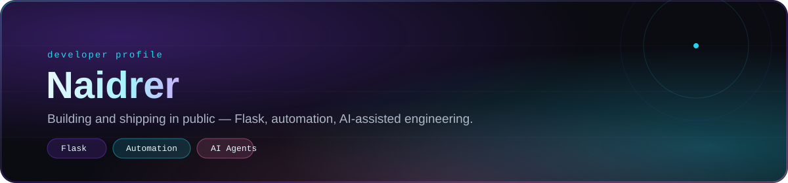
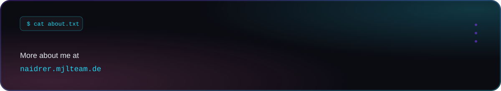
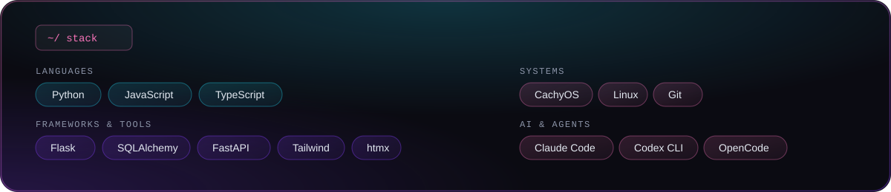
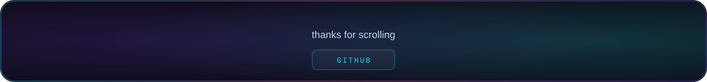

 

<picture>
  <source media="(prefers-color-scheme: dark)" srcset="https://raw.githubusercontent.com/naydrer89/naydrer89/output/github-contribution-grid-snake-dark.svg" />
  <source media="(prefers-color-scheme: light)" srcset="https://raw.githubusercontent.com/naydrer89/naydrer89/output/github-contribution-grid-snake.svg" />
  
</picture>

 

 

 

 

